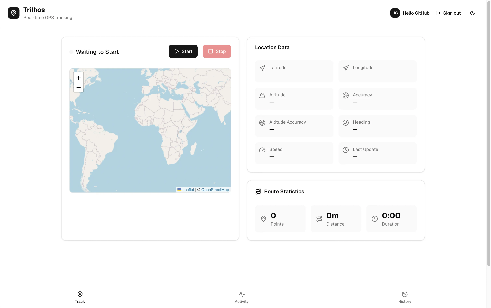
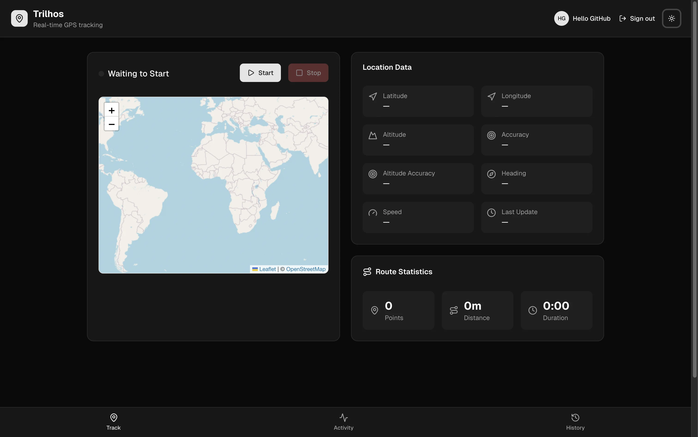
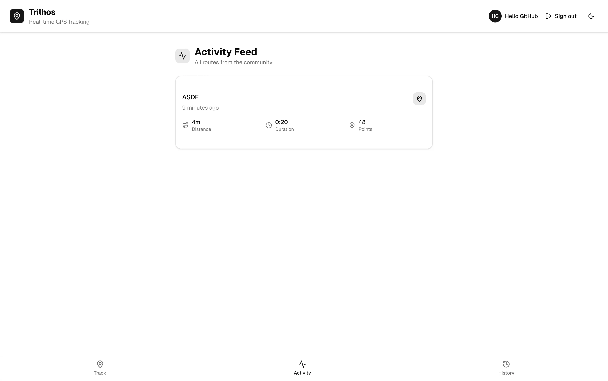
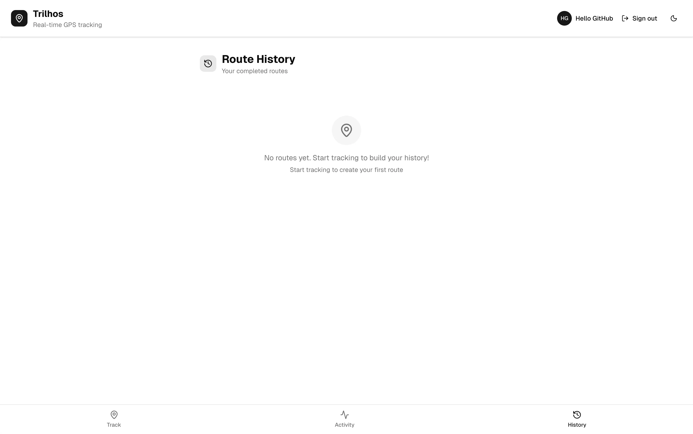

# [](https://nextjs.org/) [](https://react.dev/) [](https://www.typescriptlang.org/) [](https://www.postgresql.org/) [](https://tailwindcss.com/) [](https://drizzle.team/orm) [](https://www.openstreetmap.org/)

**Trilhos** (Portuguese for "tracks" or "trails") is a GPS route tracking Progressive Web App. Track your outdoor activities in real-time, save routes with automatic location-based naming, and view your activity history.

## ⚡ Quick Start

```bash
# Clone and install
git clone https://github.com/pfjndev/trilhos.git
cd trilhos
npm install

# Configure environment
cp .env.example .env.local
# Edit .env.local with your DATABASE_URL and AUTH_SECRET

# Setup database
npx drizzle-kit push

# Run development server
npm run dev
```

Visit [http://localhost:3000](http://localhost:3000)

## 📖 Documentation

Comprehensive documentation is available in the [Wiki](https://github.com/pfjndev/trilhos/wiki):

- **[Getting Started](https://github.com/pfjndev/trilhos/wiki/Getting-Started)** - Installation and setup
- **[Development Guide](https://github.com/pfjndev/trilhos/wiki/Development-Guide)** - Code style and patterns
- **[Docker Setup](https://github.com/pfjndev/trilhos/wiki/Docker-Setup)** - Local HTTPS development
- **[Deployment Guide](https://github.com/pfjndev/trilhos/wiki/Deployment-Guide)** - Production deployment

## ✨ Features

- **Real-time GPS Tracking** - High-accuracy location tracking using browser Geolocation API
- **Interactive Maps** - Leaflet-based maps with live position and route visualization
- **Auto-generated Route Names** - Reverse geocoding via OpenStreetMap Nominatim
- **Route Statistics** - Distance, duration, and average speed calculations
- **Activity Feed** - Community feed showing routes from all users
- **User Authentication** - Email/password + OAuth (Google, GitHub)

## 📸 Screenshots

<p align="center">
  
  
</p>

<p align="center">
  
  
</p>