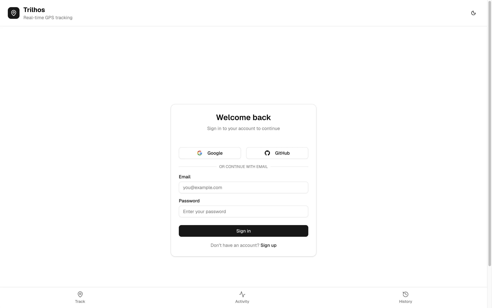
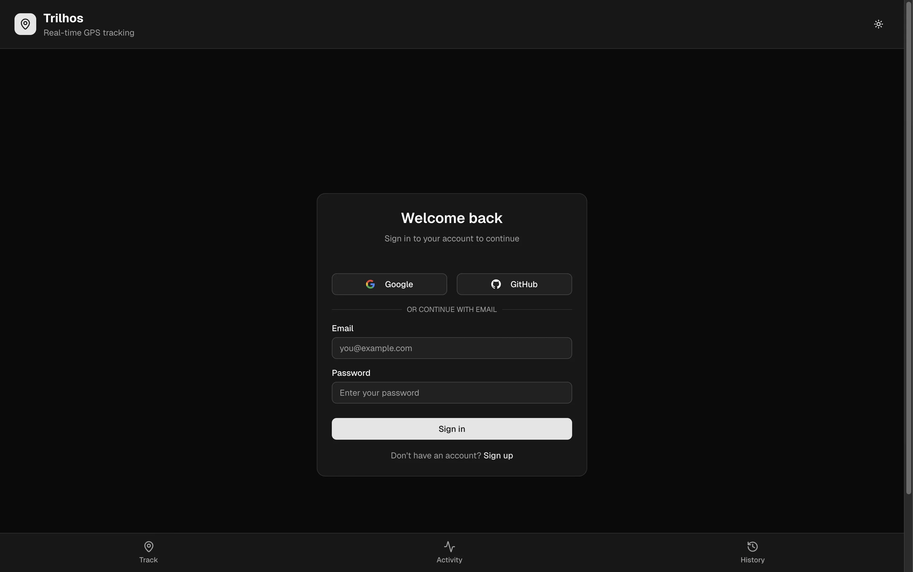
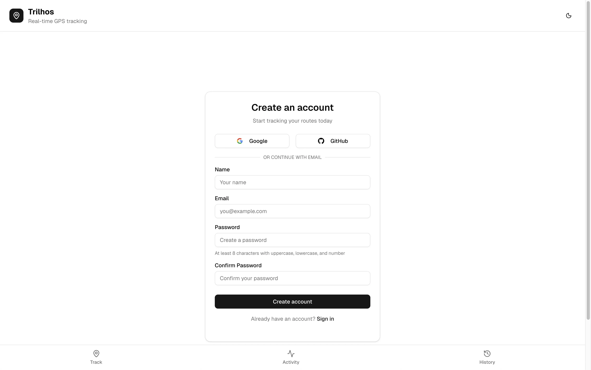
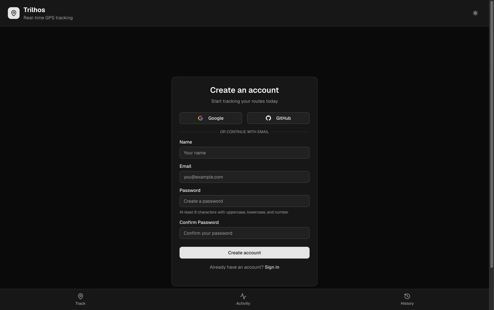
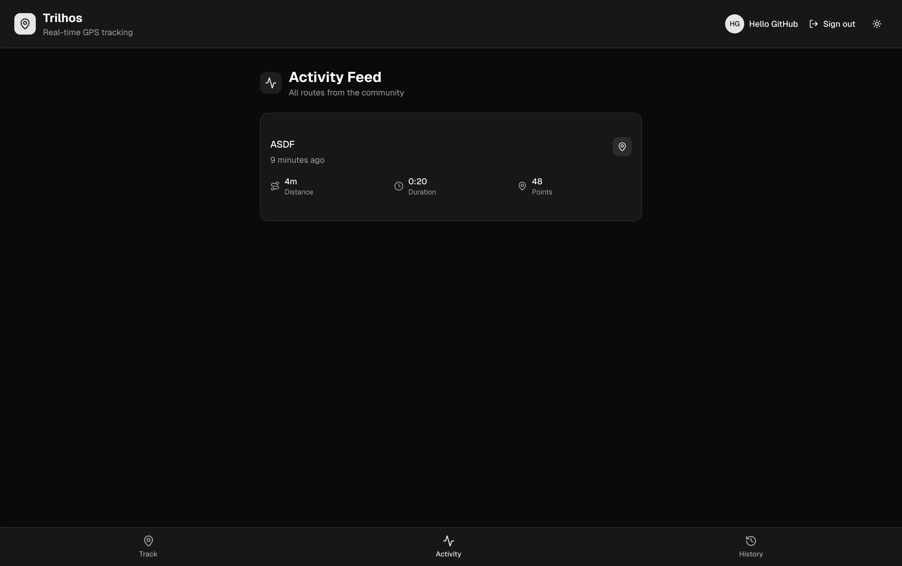
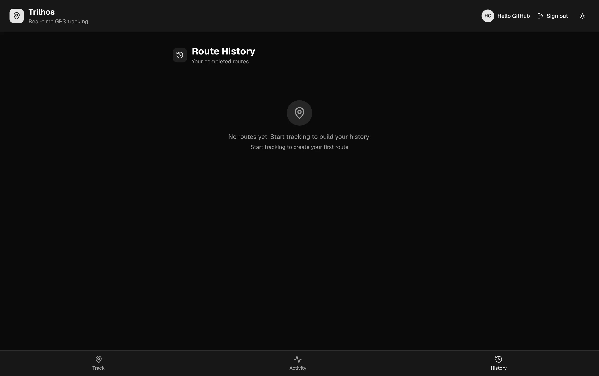
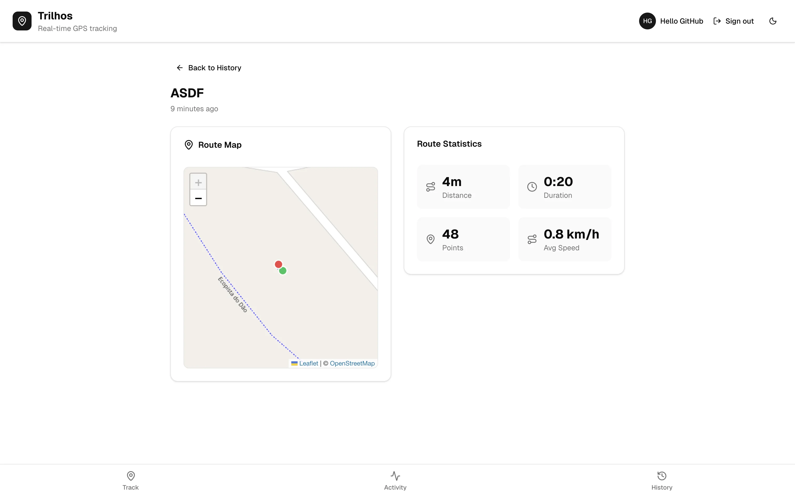
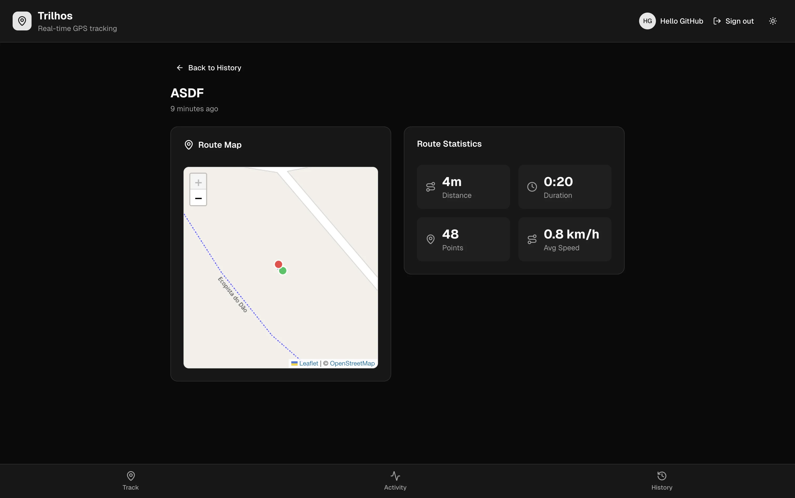

# Trilhos

> GPS route tracking PWA built with Next.js

[](https://nextjs.org/)
[](https://react.dev/)
[](https://www.typescriptlang.org/)
[](https://www.postgresql.org/)
[](https://tailwindcss.com/)

**Trilhos** (Portuguese for "tracks" or "trails") is a privacy-respecting GPS route tracking Progressive Web App. Track your outdoor activities in real-time, save routes with automatic location-based naming, and view your activity history.

---

## Screenshots

### Login

<p align="center">
  
  
</p>

### Register

<p align="center">
  
  
</p>

### Home (GPS Tracking)

<p align="center">
  
  
</p>

### Activity Feed

<p align="center">
  
  
</p>

### Route History

<p align="center">
  
  
</p>

### Route Details

<p align="center">
  
  
</p>

---

## Features

- **Real-time GPS Tracking** - High-accuracy location tracking using browser Geolocation API
- **Interactive Maps** - Leaflet-based maps with live position and route visualization
- **Auto-generated Route Names** - Reverse geocoding via OpenStreetMap Nominatim
- **Route Statistics** - Distance (Haversine formula), duration, average speed
- **Route History** - Personal history of all completed routes
- **Activity Feed** - Community feed showing routes from all users
- **User Authentication** - Email/password + OAuth (Google, GitHub)
- **Dark Mode** - System-aware theme with persistent preference
- **Mobile-first Design** - Responsive UI with safe area handling for notched devices

---

## Tech Stack

**Core:** Next.js 16 · React 19 · TypeScript 5 · PostgreSQL 16

**UI:** Tailwind CSS 4 · shadcn/ui · Radix UI · Lucide Icons

**Backend:** Drizzle ORM · NextAuth.js v5 · Server Actions

**Maps:** Leaflet · OpenStreetMap

**Full details:** See the [Tech Stack](https://github.com/pfjndev/trilhos/wiki/Tech-Stack) wiki page

---

## Quick Start

```bash
# Clone and install
git clone https://github.com/pfjndev/trilhos.git
cd trilhos
npm install

# Configure environment
cp .env.example .env.local
# Edit .env.local with your DATABASE_URL and AUTH_SECRET

# Setup database
npx drizzle-kit push

# Run development server
npm run dev
```

Visit [http://localhost:3000](http://localhost:3000)

**For mobile testing with HTTPS:** See the [Docker Setup](https://github.com/pfjndev/trilhos/wiki/Docker-Setup) guide

---

## Documentation

Comprehensive documentation is available in the [Wiki](https://github.com/pfjndev/trilhos/wiki):

### Getting Started
- **[Getting Started](https://github.com/pfjndev/trilhos/wiki/Getting-Started)** - Installation and setup
- **[Tech Stack](https://github.com/pfjndev/trilhos/wiki/Tech-Stack)** - Technologies and libraries
- **[Project Structure](https://github.com/pfjndev/trilhos/wiki/Project-Structure)** - Directory layout

### Architecture & API
- **[Architecture Overview](https://github.com/pfjndev/trilhos/wiki/Architecture-Overview)** - System design and data flow
- **[Component Reference](https://github.com/pfjndev/trilhos/wiki/Component-Reference)** - UI components catalog
- **[Hooks Reference](https://github.com/pfjndev/trilhos/wiki/Hooks-Reference)** - Custom React hooks
- **[Server Actions Reference](https://github.com/pfjndev/trilhos/wiki/Server-Actions-Reference)** - Backend actions

### Development & Deployment
- **[Development Guide](https://github.com/pfjndev/trilhos/wiki/Development-Guide)** - Code style and patterns
- **[Docker Setup](https://github.com/pfjndev/trilhos/wiki/Docker-Setup)** - Local HTTPS development
- **[Deployment Guide](https://github.com/pfjndev/trilhos/wiki/Deployment-Guide)** - Production deployment

---

## Contributing

We welcome contributions! Please see the [Development Guide](https://github.com/pfjndev/trilhos/wiki/Development-Guide) for:

- Code style guidelines
- Component patterns
- Server Action conventions
- Testing guidelines

---

## Links

- [Documentation Wiki](https://github.com/pfjndev/trilhos/wiki)
- [Report Issues](https://github.com/pfjndev/trilhos/issues)
- [Discussions](https://github.com/pfjndev/trilhos/discussions)

---

**Built with Next.js, React, and TypeScript**
